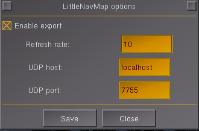

# Add-on usage

LittleNavMap add-on for FlightGear Flight Simulator. Enables communication with
LittleNavMap software. Provides online information of player's aircraft to the
LittleNavMap (https://albar965.github.io/littlenavmap.html)

# FlightGear configuration

Start FlightGear. Go to menu `Add-on -> Little Nav Map'.

In this dialog you can enable protocol activity. When enabled the protocol is
enabled and starts serving UDP packets to the host provided in this configuration
on specified port. You can define update frequency (in Hertz) e.g. 0.1 -> each
10 seconds update will be send, 10 Hz -> every 0.1 second new update will be sent.

# LittleNavMap configuration

<TODO>

Have fun !

