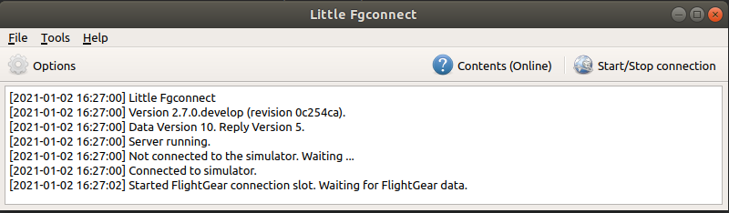
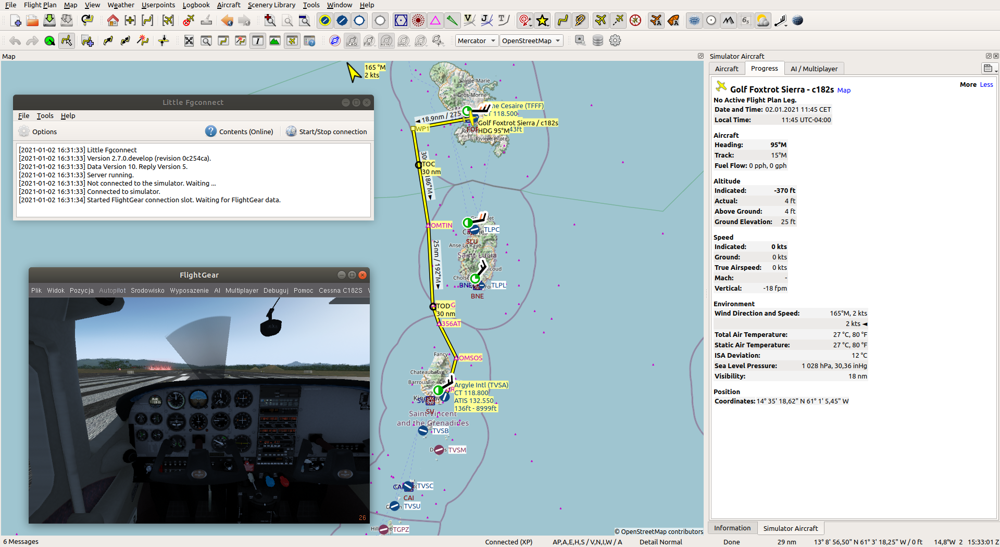

# Add-on usage

LittleNavMap add-on for FlightGear Flight Simulator. Enables communication with
LittleNavMap software. Provides online information of player's aircraft to the
LittleNavMap (https://albar965.github.io/littlenavmap.html)

# FlightGear configuration

Start FlightGear. Go to menu `Add-on -> Little Nav Map'.

In this dialog you can enable protocol activity. When enabled the protocol is
enabled and starts serving UDP packets to the host provided in this configuration
on specified port. You can define update frequency (in Hertz) e.g. 0.1 -> each
10 seconds update will be send, 10 Hz -> every 0.1 second new update will be sent.

# LittleNavMap configuration

NOTE: LittleFgConnect is an additional tool to connect FlightGear and LittleNavMap.
It mimicks the connection that is currently available as XPlane connection so in
the LittleNavMap you should configure everything accoring to the XPlane connection.
In this way there is right now no change in the LittleNavMap code in order to get
it running.

Run LittleNavMap FlightGear connector (compile it) from the fgconnect repository
(https://github.com/slawekmikula/littlefgconnect).

Start it and connect to the FlightGear simulator (it will open the UDP server
and starts listening for data from this Add-On).

Start LittleNavMap. It should display that the connection to the XPlane is ready
and waiting for the data. When FlightGear starts with this Addon enabled it should
send the information about current aircraft position and it's data to the LittleNavMap.

Have fun !

